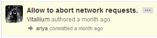
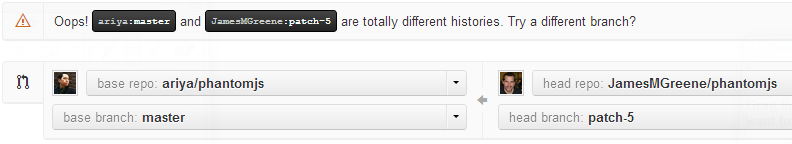

# James M. Greene [][me/gh] [][me/t] [][me/email] [][me/site]  

---

## GitHub To-Do List
This is [the start of] the list of ideas for tasks I'd love to help GitHub accomplish! :octocat:  

If they are new ideas, then I am proud to bring them to the table.  If not, then I am proud to already be
mentally aligned with GitHub's future direction!


### Repos
 - Allow users to choose which branch is auto-hosted, i.e. don't restrict it to just "gh-pages".
 - Add a license data field for the repo itself. I _wish_ this could be a required field but I'm sure
   that attempting to retroactively add it to existing repos could prove troublesome.
 - Finer grain repo permissions (at least for organizations, if not also users):
    - [GitHub.com Inline File Editing][gh/blog/inline-file-editing] is awesome (for appropriate scenarios)! That said,
      I would love to see repo owners given the option to set how this works for repo collaborators: either allow them to
      edit and commit/push directly (the current behavior) or else force it to do an auto-fork as if they did _not_ have
      push access to the repo &mdash; essentially to offer a way to "suggest" that, even though they are a repo collaborator,
      their changes should still be reviewed, at least by another repo collaborator if not the repo owner.  
      For example, very shortly after [**@jonrohan**][gh/jon] added me as a repo collaborator for [ZeroClipboard][zc/repo],
      I edited a file on the GitHub.com website. However, I was surprised to find out [when I committed the changes] that I
      had actually done a real "Commit Changes" to the master branch's file rather than doing a "Propose File Change" as in
      the auto-fork scenario (and yes, I have since noticed the difference in the button text; that is indeed helpful).
      My intent was to auto-fork so that Jon and I could discuss the PR but only after committing [an incomplete
      change] did I realize my mistake.
    - For bigger projects (which are hopefully setup as organizations), it would be nice to be able to give "collaborators"
      permissions over particular aspects of the project (e.g. "issue administrators" vs. "wiki administrators" vs. "code
      collaborators", etc.), as well as possibly of branches (e.g. can work on the "docs" branch vs. "gh-pages" branch vs.
      "master" branch), etc. Of course, striking the right balance of simplicity vs. capability is the obvious quandry
      to tackle here.


### Pull Requests
 - Make pull request history searchable, one of [**@ariya**][gh/ariya]'s [biggest laments][ariya/blog/searchability].
   I'm not positive if this _isn't_ the expected behavior today but it may be a result of the fact that [PhantomJS][pjs/repo]
   does not have its Issues feature enabled [yet].
 - Consider providing a way to integrate a [CLA][wiki/cla] check
   into the PR submission process. While many projects will not need this functionality, there are definitely some
   biggers projects/organizations (e.g. jQuery, Dojo, etc.) that I'm sure would appreciate this feature.
 - I love GitHub's auto-merge functionality for PRs that don't have any merge conflicts. However, I very much dislike
   the commit that it generates as, although it does honor the PR contributor's commit in the history, it adds a
   second commit for the merge:  
     &nbsp; &nbsp; &nbsp;   
   Rather, I would _love_ to see auto-merges result in a more compact commit history like those of a cherry-picked commit:  
     &nbsp; &nbsp; &nbsp;   
 - _Bug fix:_ currently, if I do an [inline file edit][gh/blog/inline-file-editing] on some file (in a repo for which
   I don't collaborator permissions) from a branch _other_ than the repo's default branch (typically "master" but not
   always), it will incorrectly try to merge it with the default branch when I commit the auto-PR ("Propose File Change"):  
     &nbsp; &nbsp; &nbsp;   
 - When viewing a patch/diff, show a control to toggle the "ignore whitespace" option (i.e. [adding `?w=1` to the URL][gh/blog/secrets]).
   Keeping helpful features hidden is not helpful.


### Issues
 - Add some sort of voting system (e.g. stars). However, it is my understanding that this feature used to be available
   and was removed. If that is indeed the case, then I'd love to learn more about why the feature was removed.
 - Add a special file (e.g. "FILING-ISSUES.md") that would suggest questions that are pertinent and should be addressed
   when filing a new issue, or provide the default text for the actual textbox when filing a new issue (like Google
   Code does, [e.g.][pjs/issues/gc/new]). For example, for [ZeroClipboard][zc/repo], I frequently reply to
   new issues by [asking which version of Flash the users have installed][zc/issue-template-example].
   The "CONTRIBUTING.md" file that we have today is nice but, IMHO, better suited for code/PR contributors rather than
   issue submitters.
 - Add some custom views for the issues list, e.g. Google Code's grid view [serves as a quick Kanban board substitute][ariya/blog/tracker]
 - Add issue relationships other than the plain ole "reference", such as a _blocking/blocked relationship_ (i.e. "Issue #2 is
   blocked on Issue #1"). While I actually generally _disagree_ with [**@ariya**][gh/ariya]'s [example of using such
   a relationship as an umbrella issue][ariya/blog/tracker] &mdash; that's a great place to utilize milestones, IMHO
   &mdash; I do agree with him that supporting issue relationships does provide value, _especially_ the blocking/blocked relationship.
 - Add a GFM editor (with Preview tab) when editing an Issue's description.
 - Add a GFM editor (with Preview tab) when editing a comment on an Issue.


### Milestones
 - Add a GFM editor (with preview tab) for the Milestone "Description" textbox.


### Activity Log/Charts
 - Improve branch visualizations, e.g. consider [**@ariya**][gh/ariya]'s [comments][ariya/blog/viewer].


### Gists
 - Allow users to name their Gists. The names don't necessarily need to be restricted to unique names as Gists
   already have unique numerical IDs; rather, the names would just to empower users to not be at the whim of
   the alphabetical order of the filename(s) in their Gist.
 - _Bug fix:_ currently, [GitHub/Campfire emojis][gh/emoji-cheat-sheet] don't work on Gists.


### GitHub-Flavored Markdown (GFM)
 - Gists are very easy add to HTML pages using the GitHub-provided script tags, e.g.:  
     &nbsp; &nbsp; &nbsp; `<script src="https://gist.github.com/JamesMGreene/4371789.js"></script>`  
   However, I think we could make it even easier to embed Gists wherever GFM is supported with some custom syntax, e.g.:  
     &nbsp; &nbsp; &nbsp; `[gist:JamesMGreene/4371789]`  
   To make the feature easier to use, we could also provide auto-complete help as they type (much like users get
   today when referencing issues by an ID number) &mdash; which would be even easier if users were allowed to name
   their Gists (see first bullet under [**Gists**](#gists)).
 - Expand the applicable contexts for [Task List markdown][gh/blog/task-list] beyond Issues/PRs/Comments/Milestones so that
   it can be used in the repo's Markdown docs and/or wiki, e.g. for project roadmaps.
 - Allow for specifying optional title text with the [GitHub/Campfire emojis][gh/emoji-cheat-sheet],
   e.g. `:octocat="GitHub":`, `!:octocat:("GitHub")`, etc. Without that capability, I had to resort to manually
   specifying the HTML for the GitHub emojis I used in the "header" of the documents in this repo.
 - Possibly add some sort of syntax validator for GFM when editing on GitHub.com (and perhaps through the GitHub native
   GUI clients as well). For example, back in October 2012, we had a GFM syntax error (an extra trailing backtick (\`)
   at the end of a code block as seen below) on the wiki for the PhantomJS:  
    ```md
`​`​`​js
function blah() { }
`​`​`​`
```
 
   This caused the whole wiki page to not have any syntax highlighting at all and it took about a week of working with
   GitHub staffer on and off to track down and resolve the actual issue.
 - Create an escape mechanism for 3+ backticks when used inside of a triple-backtick-fenched code block. I [had to use
   zero width space characters][jmg/gfm-escape-backtick-commit] (`&#x200B;`) to do so [for the previous bullet!].


### Increasing Popularity
 - We can help more projects migrate to GitHub by providing more streamlined import processes.
   For example, I migrated the Issue Tracker for the [PhantomJS][pjs/repo] project
   from [Google Code][pjs/issues/gc/list] to [GitHub][pjs/issues/gh-dry-run] by using [**@technoweenie**][gh/rick]'s
   [GitHub-internal import process][gh/import-gist] coupled with some Node.js modules of my own
   ([gc2gh-issue-migrator][jmg/repo/gc2gh] and [gcph-client][jmg/repo/gcph-client]) to make the process even easier.
   
   With regard to migrating from Google Code in particular, their [public Issue Tracker API][gc/issue-tracker/api]
   will be [shutdown on June 14, 2013][gc/issue-tracker/closure], so time is of the essence if we want to capitalize
   and migrate more projects from there.


[me/gh]: http://github.com/JamesMGreene
[me/t]: http://twitter.com/_JamesMGreene
[me/email]: mailto:james.m.greene@gmail.com
[me/site]: http://jamesgreene.net/
[gh/ariya]: https://github.com/ariya
[gh/rick]: https://github.com/technoweenie
[gh/jon]: https://github.com/jonrohan
[gh/import-gist]: https://gist.github.com/7f75ced1fa7576412901/006a7c69f57521e026be85937c9641e861e81802
[gh/blog/task-list]: https://github.com/blog/1375-task-lists-in-gfm-issues-pulls-comments
[gh/blog/inline-file-editing]: https://github.com/blog/143-inline-file-editing
[gh/blog/secrets]: https://github.com/blog/967-github-secrets
[gh/emoji-cheat-sheet]: http://www.emoji-cheat-sheet.com/
[ariya/blog/searchability]: http://ariya.ofilabs.com/2012/08/github-and-lack-of-searchability.html
[ariya/blog/tracker]: http://ariya.ofilabs.com/2012/11/issue-tracker-github-vs-google-code.html
[ariya/blog/viewer]: http://ariya.ofilabs.com/2012/09/git-viewer-github-vs-google-code.html
[pjs/repo]: https://github.com/ariya/phantomjs
[pjs/issues/gc/new]: http://code.google.com/p/phantomjs/issues/entry
[pjs/issues/gc/list]: http://code.google.com/p/phantomjs/issues/list
[pjs/issues/gh-dry-run]: https://github.com/JamesMGreene/phantomjs-issues
[jmg/repo/gc2gh]: https://github.com/JamesMGreene/gc2gh-issue-migrator
[jmg/repo/gcph-client]: https://github.com/JamesMGreene/node-gcph-client
[jmg/gfm-escape-backtick-commit]: https://github.com/JamesMGreene/gh-cover-letter/commit/852bbdf78d3542c4e788970785139b5cd000391e#L0R101
[gc/issue-tracker/api]: http://code.google.com/p/support/wiki/IssueTrackerAPI
[gc/issue-tracker/closure]: http://googleblog.blogspot.com/2012/12/winter-cleaning.html
[zc/repo]: https://github.com/jonrohan/ZeroClipboard
[zc/issue-template-example]: https://github.com/jonrohan/ZeroClipboard/issues/85#issuecomment-12543512
[wiki/cla]: http://en.wikipedia.org/wiki/Contributor_License_Agreement

