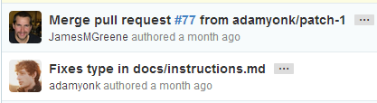
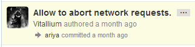

# GitHub To-Do List

## Repos
 - Allow users to choose which branch is auto-hosted, i.e. don't restrict it to just "gh-pages".
 - Add a license data field for the repo itself. I _wish_ this could be a required field but I'm sure
   that attempting to retroactively add it to existing repos could prove troublesome.

## Pull Requests
 - Make pull request history searchable, one of [**@ariya**][gh/ariya]'s [biggest laments][ariya/blog/searchability].
   I'm not positive if this _isn't_ the expected behavior today but it may be a result of the fact that [PhantomJS][pjs/repo]
   does not have its Issues feature enabled [yet].
 - Consider providing a way to integrate a [CLA](http://en.wikipedia.org/wiki/Contributor_License_Agreement) check
   into the PR submission process. While many projects will not need this functionality, there are definitely some
   biggers projects/organizations (e.g. jQuery, Dojo, etc.) that I'm sure would appreciate this feature.
 - I love GitHub's auto-merge functionality for PRs that don't have any merge conflicts. However, I very much dislike
   the commit that it generates as, although it does honor the PR contributor's commit in the history, it adds a
   second commit for the merge:  
     &nbsp; &nbsp; &nbsp;   
   Rather, I would _love_ to see auto-merges result in a more compact commit history like those of a cherry-picked commit:  
     &nbsp; &nbsp; &nbsp;   

## Issues
 - Add some sort of voting system (e.g. stars). However, it is my understanding that this feature used to be available
   and was removed. If that is indeed the case, then I'd love to learn more about why the feature was removed.
 - Add a special file (e.g. "NEW-ISSUE.md") that would suggest questions that are pertinent and should be addressed
   when filing a new issue, or provide the default text for the actual textbox when filing a new issue (like Google
   Code does, [e.g.](http://code.google.com/p/phantomjs/issues/entry)). For example, for [ZeroClipboard](https://github.com/jonrohan/ZeroClipboard), I frequently reply to
   new issues by [asking which version of Flash the users have installed](https://github.com/jonrohan/ZeroClipboard/issues/85#issuecomment-12543512).
   The "CONTRIBUTING.md" file that we have today is nice but, IMHO, better suited for code/PR contributors rather than
   issue submitters.
 - Add some custom views for the issues list, e.g. Google Code's grid view [serves as a quick Kanban board substitute][ariya/blog/tracker]
 - Add issue relationships other than the plain ole "reference", such as a _blocking/blocked relationship_ (i.e. "Issue #2 is
   blocked on Issue #1"). While I actually generally _disagree_ with [**@ariya**][gh/ariya]'s [example of using such
   a relationship as an umbrella issue][ariya/blog/tracker] &mdash; that's a great place to utilize milestones, IMHO
   &mdash; I do agree with him that supporting issue relationships does provide value, _especially_ the blocking/blocked relationship.

## Milestones
 - ?

## Activity Log/Charts
 - Improve branch visualizations, e.g. consider [**@ariya**][gh/ariya]'s [comments](http://ariya.ofilabs.com/2012/09/git-viewer-github-vs-google-code.html).

## Gists
 - Allow users to name their Gists. The names don't necessarily need to be restricted to unique names as Gists
   already have unique numerical IDs; rather, the names would just to empower users to not be at the whim of
   the alphabetical order of the filename(s) in their Gist.
 - _Bug fix:_ currently, [GitHub emojis](http://www.emoji-cheat-sheet.com/) don't work on Gists.

## GitHub-Flavored Markdown (GFM)
 - Expand the applicable contexts for [Task List markdown][gh/blog/task-list] beyond Issues/PRs/Comments so that
   it can be used in the repo's Markdown docs and/or wiki, e.g. for project roadmaps.
 - Gists are very easy add to HTML pages using the GitHub-provided script tags, e.g.:
      ``  
   However, I think we could make it even easier to embed Gists wherever GFM is supported with some custom syntax, e.g.:
      `[gist:JamesMGreene/4371789]`  
   To make the feature easier to use, we could also provide auto-complete help as they type (much like users get
   today when referencing issues by an ID number) &mdash; which would be even easier if users were allowed to name
   their Gists (see previous bullet).

## Increasing Popularity
 - We can help more projects migrate to GitHub by providing more streamlined import processes.
   For example, I migrated the Issue Tracker for the [PhantomJS][pjs/repo] project
   from [Google Code][pjs/issues/gc] to [GitHub][pjs/issues/gh-dry-run] by using [**@technoweenie**][gh/rick]'s
   [GitHub-internal import process][gh/import-gist] coupled with some Node.js modules of my own
   ([gc2gh-issue-migrator][jmg/repo/gc2gh] and [gcph-client][jmg/repo/gcph-client]) to make the process even easier.
   
   With regard to migrating from Google Code in particular, their [public Issue Tracker API][gc/issue-tracker/api]
   will be [shutdown on June 14, 2013][gc/issue-tracker/closure], so time is of the essence if we want to capitalize
   and migrate more projects from there.

[gh/ariya]: https://github.com/ariya
[gh/rick]: https://github.com/technoweenie
[gh/import-gist]: https://gist.github.com/7f75ced1fa7576412901/006a7c69f57521e026be85937c9641e861e81802
[gh/blog/task-list]: https://github.com/blog/1375-task-lists-in-gfm-issues-pulls-comments
[ariya/blog/searchability]: http://ariya.ofilabs.com/2012/08/github-and-lack-of-searchability.html
[ariya/blog/tracker]: http://ariya.ofilabs.com/2012/11/issue-tracker-github-vs-google-code.html
[pjs/repo]: https://github.com/ariya/phantomjs
[pjs/issues/gc]: http://code.google.com/p/phantomjs/issues/list
[pjs/issues/gh-dry-run]: https://github.com/JamesMGreene/phantomjs-issues
[jmg/repo/gc2gh]: https://github.com/JamesMGreene/gc2gh-issue-migrator
[jmg/repo/gcph-client]: https://github.com/JamesMGreene/node-gcph-client
[gc/issue-tracker/api]: http://code.google.com/p/support/wiki/IssueTrackerAPI
[gc/issue-tracker/closure]: http://googleblog.blogspot.com/2012/12/winter-cleaning.html
